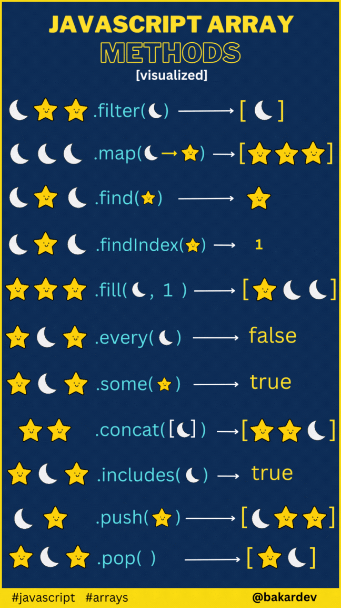

# Introangular

This project was generated with [Angular CLI](https://github.com/angular/angular-cli) version 18.0.7.

## Development server

Run `ng serve` for a dev server. Navigate to `http://localhost:4200/`. The application will automatically reload if you change any of the source files.

## Code scaffolding

Run `ng generate component component-name` to generate a new component. You can also use `ng generate directive|pipe|service|class|guard|interface|enum|module`.

## Build

Run `ng build` to build the project. The build artifacts will be stored in the `dist/` directory.

## Running unit tests

Run `ng test` to execute the unit tests via [Karma](https://karma-runner.github.io).

## Running end-to-end tests

Run `ng e2e` to execute the end-to-end tests via a platform of your choice. To use this command, you need to first add a package that implements end-to-end testing capabilities.

## Further help

To get more help on the Angular CLI use `ng help` or go check out the [Angular CLI Overview and Command Reference](https://angular.dev/tools/cli) page.

# BootStrap5
- Flexbox: 
The biggest difference between Bootstrap 3 and Bootstrap 4 & 5 is that Bootstrap 5 now uses flexbox, instead of floats, to handle the layout.
- Gutter : Is the space between columns in the grid system. and we use gx- and gy-. .gy-*: Vertical gutters.
.gx-*: Horizontal gutters.
  ```html
  <div class="row gx-3">
  <div class="col">
    Column 1
  </div>
  <div class="col">
    Column 2
  </div>
</div>
  ```


# JS Function

- Filter
The filter method in JavaScript is used to create a new array with all elements that pass a test implemented by the provided function. This method does not mutate the original array but returns a new array with the elements that meet the condition.

- Find
The find method in JavaScript is used to search through an array and return the first element that satisfies a given condition. It is a higher-order function that takes a callback function as an argument. This callback function is executed once for each element in the array until it finds one where the callback returns a truthy value. If no values satisfy the testing function, undefined is returned.

- online ide: https://www.programiz.com/online-compiler/5CcawMfn2pGWk


# GIT STASH:

- is a powerful command in Git that allows you to temporarily save changes that are not yet ready to be committed. This can be especially useful when you need to switch branches, work on something else, or pull the latest changes without committing unfinished work.

- use command : git stash to stash the code that you don't want to commit
- use command : git stash pop : to unstash or back to your original code


